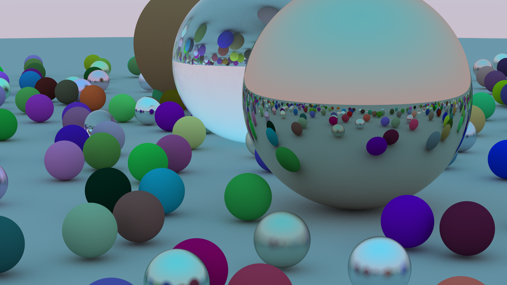

Following along with
[_Ray Tracing in One
Weekend_](https://raytracing.github.io/books/RayTracingInOneWeekend.html)
to learn a bit about computer graphics.

An image of "lots of random spheres," rendered by the path-tracer herein,
showcasing an implementation of rudimentary antialiasing, a basic model of Lambertian reflectance,
and a basic model of the reflection and refraction of light at dielectric media interfaces:

